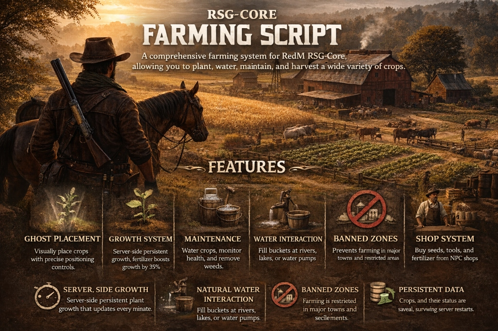

# rsg-farming by devchacha

A comprehensive farming system for RedM RSG-Core, allowing you to plant, water, maintain, and harvest a wide variety of crops.

## Features
- **Ghost Placement System**: visual placement of crops with fine-tuned positioning controls.
- **Growth System**: 
  - Server-side persistent growth (ticks every minute).
  - Fertilizer boosts growth speed by 35%.
  - Visual stages of plant growth.
- **Maintenance**: 
  - Manage Water levels.
  - Remove Weeds to ensure healthy crops.
  - Monitor Plant Health.
- **Water Interaction**: 
  - Interact with natural water sources (Rivers, Lakes) and Water Pumps.
  - Fill Buckets, Drink, or Wash yourself.
- **Banned Zones**: Prevents farming in major towns and restricted areas.
- **Shop System**: NPC shops with blips to purchase seeds, tools, and fertilizer.
- **Persistence**: Crops and their status are saved in the database across restarts.

## Dependencies
- `rsg-core`
- `rsg-inventory`
- `rsg-target`
- `ox_lib`
- `oxmysql`

## Installation

### 1. Download & Place
- Download the resource and place it in your `resources` folder.
- Rename the folder to `rsg-farming`.

### 2. Database Import
- Import the `farming.sql` file into your database to create the necessary tables.

### 3. Add Items
- Copy the contents of the `items.lua` file included in this resource.
- Paste them into your shared items file (e.g., `rsg-core/shared/items.lua`).
- Ensure you have the corresponding images for these items in your inventory images folder.

### 4. Server Config
- Add `ensure rsg-farming` to your `server.cfg` file.
- **Order Matters**: Ensure it is started **after** `rsg-core`, `rsg-inventory`, and `ox_lib`.

## Configuration
Edit `config.lua` to customize the server mechanics.

### Changing Growth Time & Watering
You can adjust how long each plant takes to grow in `Config.Seeds`.
- **totaltime**: Time in minutes for full growth.
- **Watering Logic**: The system **automatically calculates water decay** based on `totaltime`.
  - A full bucket of water will last exactly **1/3rd of the growth cycle**.
  - This forces players to tend to their crops ~3 times before harvest.

**Example Config Entry:**
```lua
["Corn"] = {
    seedname = "corn_seed", 
    prop = "p_corn01x",    
    totaltime = 15,       -- 15 Minutes to grow. Needs watering every 5 mins.
    rewardcount = 2,      -- Base reward amount
    stages = { ... }      -- Multi-stage visual models
},
```

Other settings:
- **Banned Zones**: Configure areas where planting is forbidden.
- **Shop Locations**: Add or move NPC shops.

## Usage

### 1. Buying Supplies
- Look for the **Green Blip** ("Farming Supplies") on the map.
- Use **Alt (Third-Eye)** on the NPC to open the shop.
- Buy **Seeds**, **Bucket**, **Fertilizer**, and other tools.

### 2. Planting Crops
- Use a **Seed** from your inventory to start placement mode.
- A ghost object will appear.
- **Controls**:
  - `W` / `A` / `S` / `D`: Move the plant position.
  - `Q` / `E`: Rotate the plant.
  - `ENTER`: Confirm placement.
  - `BACKSPACE`: Cancel placement.

### ⛔ Restricted Zones
Farming is **strictly prohibited** within the limits of major towns and settlements. You cannot plant crops in:
- Valentine & Valentine Station
- Saint Denis
- Rhodes
- Blackwater
- Armadillo
- Annesburg
- Strawberry
- Tumbleweed

### 3. Water & Maintenance
- **Getting Water**:
  1. Equip/Hold a **Bucket**.
  2. Go to a **River**, **Lake**, or **Water Pump**.
  3. Press `[ALT]` when prompted to open the water menu.
  4. Select **Fill Bucket** to get a `fullbucket`.
     - *You can also Drink or Wash yourself here.*

#### Supported Water Sources
You can fill your bucket at the following locations:
- Sea of Coronado
- San Luis River
- Lake Don Julio
- Flat Iron Lake
- Upper Montana River
- Owanjila
- HawkEye Creek
- Little Creek River
- Dakota River
- Beartooth Beck
- Lake Isabella
- Cattail Pond
- Deadboot Creek
- Spider Gorge
- O'Creagh's Run
- Moonstone Pond
- Roanoke Valley
- Elysian Pool
- Lannahechee River

### 🌿 Available Crops
There are **37** different types of crops you can cultivate:

| Type | Crop Name | Type | Crop Name |
| :--- | :--- | :--- | :--- |
| 🥬 | Alaskan Ginseng | 🥣 | English Mace |
| 🥬 | American Ginseng | 🍺 | Hop |
| 🍎 | Apple | 🍋 | Lemon |
| 🍌 | Banana | 🥬 | Lettuce |
| 🌾 | Barley | 🌿 | Milk Weed |
| 🍇 | Black Currant | 🌿 | Oleander Sage |
| 🌺 | Blood Flower | 🌿 | Oregano |
| 🥦 | Broccoli | 🍄 | Parasol Mushroom |
| 🌼 | Choc Daisy | 🍑 | Peach |
| 🍒 | Cherry | 🌶️ | Pepper |
| ☕ | Coffee | 🥔 | Potato |
| 🌽 | Corn | 🌺 | Prairie Poppy |
| 🍒 | Creekplum | 🎃 | Pumpkin |
| 🌿 | Creeking Thyme | 🍇 | Red Raspberry |
| 🧅 | Crows Garlic | 🌿 | Red Sage |
| 🍬 | Sugar (Sugarcane) | 🍵 | Tea |
| 🍂 | Tobacco | 🌾 | Wheat |
| 🥕 | Wild Carrot | 🌿 | Wild Mint |
| 🫐 | Wintergreen Berry | 🌼 | Yarrow |

- **Tending Crops**:
  1. Go to your planted crop.
  2. Use **Alt (Third-Eye)** and select **Inspect Crop**.
  3. A menu will open showing:
     - Water %, Health %, Weed %, Growth %.
  4. Perform actions:
     - **Water**: Requires `fullbucket`.
     - **Fertilize**: Requires `fertilizer` (Speeds up growth).
     - **Remove Weeds**: Keeps the plant healthy.

### 4. Harvesting
- Monitor the Growth %.
- Once it reaches **100%**, the Harvest option will become available in the menu.
- Harvest to receive your crops!

## Credits
- Script created by **devchacha**
